# behavioral-cloning

1. This project includes the following files:

model.py containing the script to create and train the model. drive.py, providied by Udacity for driving the car in simulator. And model.h5 containing a trained convolution neural network.

2. With the provided Udacity simulator and my drive.py file, the car can be driven autonomously around a track by executing

python drive.py model.h5

3. The model.py file contains my code for training and saving a convolution neural network. The file shows the pipeline I used for training and validating the model, and it contains comments to explain how the code works.

Mode Architecture and Training Strategy

1. My model is based on the Comma.ai model. It consists of a convolution neural network with a 8x8 filter size on the first convolutional layer and a 5X5 filter on the next two convolutional layers. The first layer has a depth of 16. The last convolutional layer has a depth of 64 (model.py lines 18-24). The model includes ELU layers to introduce nonlinearity after each convolutional layer(code line 20) (and for a faster learning rate than relu), and a maxpooling layer after the first two convolutional layers. The data is normalized in the model using a Keras lambda layer (code line 18).

2. This model contains two dropout layers to reduce overfitting. A small drop out of .2 before the first Dense layer and a larger dropout of .5 before the final dense layer. There are 2 dense layers. The model was trained and validated on different data sets to guard against overfitting (code line 10-16). The model was tested by running it through the simulator and ensuring that the vehicle could stay on the track.

3. The model uses an adam optimizer so the learing rate was not tuned manually.

4. Training data was chosen to keep the vehicle driving on the road. I used a combination of center lane driving and recovering from the left and right sides of the road. I used training data from both tracks.

5. My Overall strategy in designing a model architecture was to go with the latest and greatest. There were two basic models I considered for my starting point. I opted for the Comma.ai model over the Nvidia model since it seemed to employ the very latest advances (namely the ELU activation layers over the RELU). Both of these models were designed and arrived at through real world testing on self driving cars. So both of them had to be good. I started training my model over 10 epochs but after about the fifth epoch the mean square error did not improve on either the training or the validation test sets. So I reduced the number of training epochs to 5. When I achieved what I thought were good results on both the training and validation sets I tested the saved model on the simulator. Unfortunately it did not work at all, the car veered to the right mmediatley going off the track. I figured my model was pretty good so I thought my data must not be good enough. And to be honest, I wasn't sure how well I drove while training - I think I may have recorded veering off the road and get a stuck a few times. So I dumped all this data and recorded center lane driving on the first course again and a couple of laps of left side and right side recovery. After training the model on the new data and achieving good results I tested it on the simulator and although it went further it now veered off to the left before the first major turn. At this point I decided maybe my best bet would be to add more data to the set by flipping the images I already have in the set and adjusting the steering angle from the flipped image. This doubled my data set and made it too large to fit into my computer's memory. I then adjusted my code using the fit_generator model. I trained and tested my model again and this time the car almost made it to the bridge before veering off to the right. I went back to the data and tried training the car on the second track. Still this didn't get it past the first bridge. I went back to the bridge and did some more left side and right side recovery again but this didn't improve things. So I finally decided to tweak my model some. I added a max pooling layer right after the first convolutional layer and trained it again. This time my model finally performed better. It got past the first bridge! But then failed on the next right turn. So I added another max pooling layer after the second convolutional layer and this did the trick. It worked! All the way around the track again and again!! 

6. My model architecure in order: 

1. a lambda normalization layers.
2. a convolutional layer using an 8x8 filter with a stride of (4, 4) and a depth of 16.
3. an ELU layer
4. a max pooling layer (2, 2)
5. a second convolutional layer using a 5x5 filter with a stride of (2, 2) and a depth of 32.
6. an ELU layer
7. a max pooling layer (2, 2)
8. a third convolutional layer using a 5x5 filter and a stride of (2, 2) and a depth of 64.
9. Flatten layer (to flatted output from previous convolutional layer)
10. a Dropout layer .2 
11. an ELU layer
12. a Dense layer ( a fully connected layer)
13. a Dropout layer .5
14. Dense layer to final output.


Creation of the Training Set & Training Process

To capture good driving behavior, I first recorded one lap of track one data using center lane driving.


```python
import numpy as np
import os
import matplotlib.image as mpimg
import pandas as pd

import matplotlib.image as mpimg
import matplotlib.pyplot as plt

# Visualizations will be shown in the notebook.
%matplotlib inline

# Load data log created in simulator into pandas dataframe
data = pd.read_csv('driving_log.csv')
    
# rename columns for dataframe.
data.columns = ['center','left','right','steering','throttle','brake','speed']

```

Here is an example of center lane driving:


```python
image = mpimg.imread(data['center'][5000])
plt.figure(figsize=(6,6))
plt.imshow(image)
```


    <matplotlib.image.AxesImage at 0x216d204eef0>


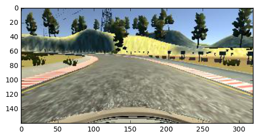


I then recorded the vehicle recovering from the left side and right sides of the road back to center so that the vehicle would learn to recover. These next few images show what a recovery looks like on the right side of the road:


```python
image = mpimg.imread(data['center'][24010])
plt.figure(figsize=(6,6))
plt.imshow(image)
```


    <matplotlib.image.AxesImage at 0x216d1b9ec50>


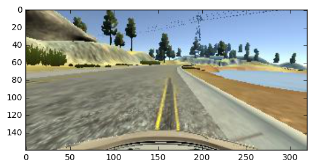


Now it begins to recover:


```python
image = mpimg.imread(data['center'][24020])
plt.figure(figsize=(6,6))
plt.imshow(image)
```


    <matplotlib.image.AxesImage at 0x216d1c72518>


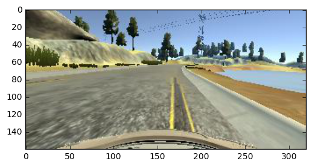


The Recovery Continues:


```python
image = mpimg.imread(data['center'][24030])
plt.figure(figsize=(6,6))
plt.imshow(image)
```


    <matplotlib.image.AxesImage at 0x216d1d49908>


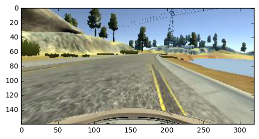


Continues:


```python
image = mpimg.imread(data['center'][24040])
plt.figure(figsize=(6,6))
plt.imshow(image)
```


    <matplotlib.image.AxesImage at 0x216d1db0d68>


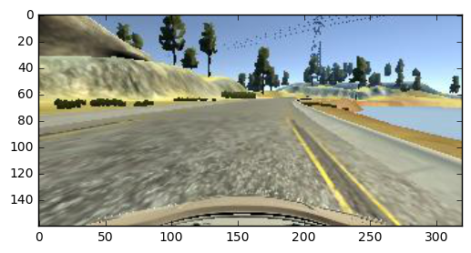


Now it has moved off the right side of the road and is angled to the middle. Continues:


```python
image = mpimg.imread(data['center'][24050])
plt.figure(figsize=(6,6))
plt.imshow(image)
```


    <matplotlib.image.AxesImage at 0x216d1e1b3c8>


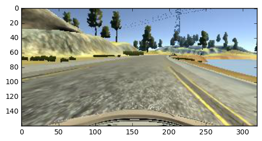


Even more away from the side of the road. At this point we can say it is in its lane, if a bit to the right.


```python
image = mpimg.imread(data['center'][24060])
plt.figure(figsize=(6,6))
plt.imshow(image)
```


    <matplotlib.image.AxesImage at 0x216d1ea8048>


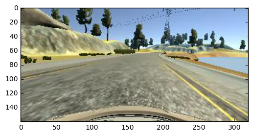


Looking even better.


```python
image = mpimg.imread(data['center'][24080])
plt.figure(figsize=(6,6))
plt.imshow(image)
```


    <matplotlib.image.AxesImage at 0x216d1f77a90>


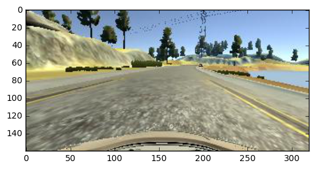


And now the car is back in the middle of the road.

I then collected data for center lane driving down track 2. Here's an example:


```python
image = mpimg.imread(data['center'][28000])
plt.figure(figsize=(6,6))
plt.imshow(image)
```


    <matplotlib.image.AxesImage at 0x216d3d08400>


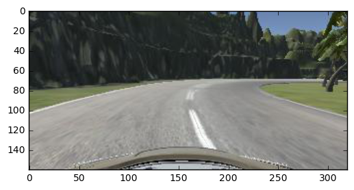


I also flipped all the images on both tracks in the generator. Here's an example of a flip:


```python

image = mpimg.imread(data['center'][28000])
image = np.fliplr(image)
plt.figure(figsize=(6,6))
plt.imshow(image)

```


    <matplotlib.image.AxesImage at 0x216d13dbe80>


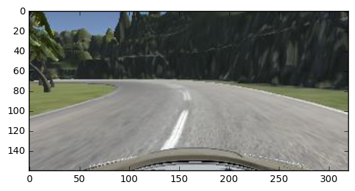


Of course I reversed the steering direction on all flipped images. I also cropped the images before sending them through my model:


```python
image = mpimg.imread(data['center'][28000])
image = np.fliplr(image)[80:,:,:]
plt.figure(figsize=(6,6))
plt.imshow(image)


```


    <matplotlib.image.AxesImage at 0x216d13b28d0>


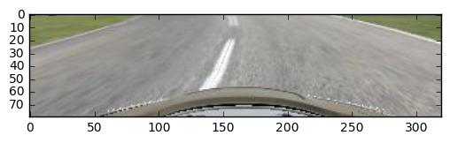


```python
print(len(data))
```

    38771
    

After the collection process, I had 38771 number of data points. 

I randomly shuffled the data set and put 20% of the data into a validation set.

I used this training data for training the model. The validation set helped determine if the model was over or under fitting. The ideal number of epochs was 5 as evidenced by observing when the training and validation mean squared errors stopped getting better... I used an adam optimizer so that manually training the learning rate wasn't necessary. And that's it. It works! Check out the code. Cheers!


```python

```
